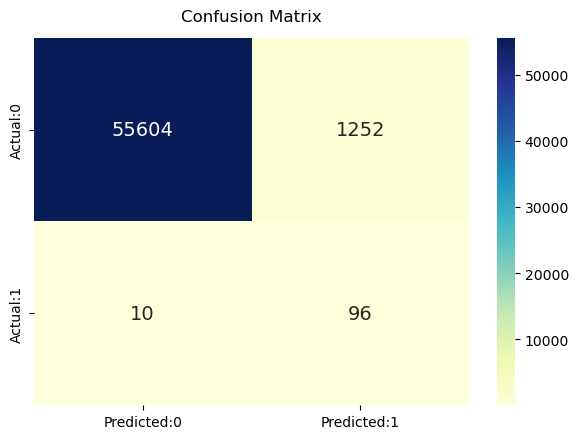

# Credit Card Fraud Detection using Logistic Regression (NumPy Only)
A complete machine learning pipeline implemented from scratch without scikit-learn.

## 📌 Table of Contents
1. [Introduction](#introduction)
2. [Dataset](#dataset)
3. [Method](#method)
4. [Installation & Setup](#installation--setup)
5. [Usage](#usage)
6. [Results](#results)
7. [Project Structure](#project-structure)
8. [Challenges & Solutions](#challenges--solutions)
9. [Future Improvements](#future-improvements)
10. [Contributors](#contributors)
11. [Contact](#contact)
12. [License](#license)

---

## 🚀 Introduction

### Motivation & Real-world Applications
- Prevent financial losses  
- Automatically flag abnormal transactions  
- Support banking and financial risk management  
- Provide an ML solution to a heavily imbalanced dataset  

### Project Objectives
- Perform operations using numpy without using loops
- Train and evaluate a Logistic Regression model implemented *entirely using NumPy*  
- Perform Exploratory Data Analysis (EDA)  
- Build a full preprocessing pipeline  
- Handle class imbalance using class weighting  
- Visualize results and metrics  
- Produce a fully reproducible ML workflow  

---

## 📊 Dataset

### Source
Dataset available on Kaggle:  
https://www.kaggle.com/mlg-ulb/creditcardfraud  
(The raw file is too large to include directly in this repository.)

### Characteristics
- 284,807 transactions  
- 492 fraud cases  
- Fraud ratio ≈ 0.17% (highly imbalanced)

### Feature Description
- **Time**: Seconds elapsed between a transaction and the first transaction  
- **Amount**: Transaction amount  
- **V1–V28**: PCA-transformed anonymized features  
- **Class**: Target label (0 = normal, 1 = fraud)

### Key Observations
- `Amount` contains extreme outliers  
- PCA features vary in scale  
- Severe class imbalance requires special treatment  

---

## ⚙️ Method

This project follows a complete machine learning workflow implemented from scratch using NumPy.  
The pipeline includes: **Data Exploration → Preprocessing → Model Building → Evaluation**.

---

### 1. Data Exploration (Notebook: `01_data_exploration.ipynb`)

The EDA step provides insights into the structure and behavior of the dataset before any modeling.  
Key analyses performed:

#### • Class Distribution
- Fraud accounts for only **0.17%** of all transactions.
- Confirmed the need for class imbalance handling.

#### • Feature Distributions
- `Amount` is highly skewed and contains extreme outliers.
- PCA components (`V1`–`V28`) follow transformed distributions that do not require outlier removal.

#### • Correlation Matrix
- PCA components show very low correlation due to PCA orthogonality.
- `Amount` and `Time` have minimal linear correlation with other features.

#### • Fraud vs Non-Fraud Comparison
- Several PCA components show clear distribution differences between fraud and non-fraud (e.g., V10, V12, V14).
- These insights confirm that Logistic Regression can learn meaningful separation.

The EDA step guided the design of the preprocessing pipeline.

---

### 2. Data Preprocessing (Notebook: `02_preprocessing.ipynb`)

#### (a) Missing Value Handling
- Replace missing values with column-wise medians.

#### (b) Outlier Processing (Amount Only)
`Amount` is clipped between the 1st and 99th percentiles to reduce extreme values: 

$$x = min(max(x, P1), P99)$$

This ensures stable gradient computation during training.

#### (c) Feature Standardization (Z-score Normalization)

$$X_{scaled} = \frac{X - \mu}{\sigma}$$


Ensures stable gradient descent and prevents sigmoid overflow.

#### (d) Train/Test Split
- 80% training  
- 20% testing  
- Random shuffle  

#### (e) Class Weighting
To handle imbalance:

Tính trọng số cho lớp dương (positive class):

$$w_{pos} = \frac{N_{neg}}{N_{pos}}$$

Áp dụng trọng số cho từng mẫu:

$$
w_{sample} = \begin{cases} 
w_{pos} & \text{if } y = 1 \\
1 & \text{if } y = 0 
\end{cases}
$$

This forces the model to pay more attention to fraud samples.

---

### 2. Logistic Regression Algorithm

#### Prediction Function

$$\hat{y} = \sigma(w^T x)$$

$$\text{sigmoid}(z) = \frac{1}{1 + e^{-z}}$$

#### Binary Cross-Entropy Loss

$$L = - \sum_{i=1}^{N} w_i \left[ y_i \log(\hat{y}_i) + (1 - y_i) \log(1 - \hat{y}_i) \right]$$

#### Gradient Descent Update

$$w := w - \eta \cdot \nabla_w L$$

#### L2 Regularization

$$\text{gradient} \mathrel{+}= \lambda w$$

In this project, Logistic Regression is implemented **entirely from scratch** using NumPy, without relying on scikit-learn.  
The implementation follows the mathematical formulation of logistic regression and uses optimized vectorized operations for efficiency.

Below is a detailed breakdown of how each component is implemented:

---

### 3. NumPy Implementation (Full Explanation)

#### **(1) Adding an Intercept Term**
Logistic Regression requires a bias term \(b\).  
Instead of treating it separately, we augment the feature matrix:

$$
X' = [1 \;\; X]
$$

NumPy implementation:

```
X = np.hstack([np.ones((X.shape[0], 1)), X])
```

#### **(2) Sigmoid Function with Overflow Protection**
The logistic function is:

$$\text{sigmoid}(z) = \frac{1}{1 + e^{-z}}$$

Large values of $z$ can cause overflow, so we clip:

```
def sigmoid(self, z):
    z = np.clip(z, -30, 30)
    return 1 / (1 + np.exp(-z))
```

#### **(3) Linear Model Output**

Prediction before activation:

```
z = X.dot(self.w)
preds = self.sigmoid(z)
```

#### **(4) Weighted Binary Cross-Entropy Loss**

To address class imbalance, each sample receives a weight $w_i$.

Loss function:

$$L = - \sum_{i=1}^{N} w_i \left[ y_i \log(\hat{y}_i) + (1 - y_i) \log(1 - \hat{y}_i) \right]$$

Gradient preparation:

```
error = preds - y
weighted_error = error * sample_weights
```

(5) Gradient Computation (Vectorized)

Gradient of logistic loss:

$$
\nabla L = X^T (w_i (\hat{y} - y))
$$

NumPy:

```
grad = X.T.dot(weighted_error) / n_samples
```
#### **(6) L2 Regularization**

Regularization term:

$$\nabla L_{reg} = \lambda w$$

Implementation:

```
grad += self.reg_lambda * self.w
```

#### **(7) Gradient Descent Weight Update**

The update rule:

$$w := w - \eta \cdot \nabla_w L$$

NumPy:

```
self.w -= self.lr * grad
```

#### **(8) Training Loop (Vectorized Optimization)**

```
for epoch in range(self.epochs):
    preds = self.sigmoid(X.dot(self.w))
    error = preds - y
    grad = X.T.dot(error * sample_weights) / n_samples
    self.w -= self.lr * grad
```

Vectorization ensures:

- No Python loops over samples
- Faster training on 284,000+ rows

#### **(9) Prediction Methods**

Predict probabilities:

$$
\hat{y} = \sigma(w^T X)
$$

```
def predict_proba(self, X):
    X = self._add_intercept(X)
    return self.sigmoid(X.dot(self.w))
```

Predict class with adjustable threshold:

```
def predict(self, X, threshold=0.5):
    return (self.predict_proba(X) >= threshold).astype(int)
```

This enables recall-oriented or precision-oriented tuning.

---

## 🛠️ Installation & Setup

#### **1. Clone and access folder**

```
git clone <https://github.com/caotranbadat2011/Programming-for-data-science.git>
cd Programming-for-data-science
```

#### **2. Create a virtual environment (recommended)**

```
python -m venv venv
source venv/bin/activate      # Linux & macOS
```

or

```
python -m venv venv
venv\Scripts\activate         # Windows
```

#### **3. Install required packages**

```
pip install -r requirements.txt
```

#### **4. Download dataset**
Dataset must be downloaded manually from Kaggle due to its large size:

- Download directly from the following link https://www.kaggle.com/datasets/mlg-ulb/creditcardfraud or the link in the file `./data/raw/link_data.txt`

- After downloading, unzip and open the folder, get the `creditcard.csv` file and move it to the `./data/raw folder`

## ▶️ Usage

#### **Step 1:** 

Press `Restart` to restart kernel and select newly created kernel. Then press `Run all` of `jupyter notebook` to run `01_data_exploration.ipynb` file to analyze data exploration.

#### **Step 2:** 

Press `Run all` of `jupyter notebook` to run file `02_preprocessing.ipynb` to preprocess the data and the result of this file will create a data file prepared for the model step.

This generates:
`./data/processed/creditcard_preprocessed.npz`

#### **Step 3:** 
Press `Run all` of `jupyter notebook` to run file 02 `03_preprocessing.ipynb` to run the model for the preprocessed data file.

## 📈 Results

**Model Performance:**

- Accuracy: 97.78%

- Precision: 7.12%

- Recall: 90.56%

- F1 Score: 13.20%

**Interpretation:**

- High recall → successfully detects most fraud cases

- Precision is naturally low because fraud is extremely rare

- Accuracy is realistic and not inflated by imbalance

- Overall good performance for a NumPy-only Logistic Regression model

**Confusion Matrix:**




## 📁 Project Structure

```
project/
│
├── data/
│ ├── raw/
│ │ └── link_data.txt # Link to Kaggle dataset (raw data too large to include)
│ │
│ └── processed/ # Saved preprocessed .npz file
│
├── notebooks/
│ ├── 01_data_exploration.ipynb # Exploratory Data Analysis (EDA)
│ ├── 02_preprocessing.ipynb # Data cleaning, clipping, scaling, saving .npz
│ └── 03_modeling.ipynb # Logistic Regression implemented using NumPy
│
├── results/
│ └── output.png # Visualization / Confusion matrix output
│
├── README.md # Project documentation
└── requirements.txt # Python dependencies
```

## ⚠️ Challenges & Solutions

#### **1. Severe Class Imbalance**

- Fraud cases extremely rare

- Solution: Class weighting using (#negative / #positive)

#### **2. Sigmoid Overflow from Large Amount Values**

Solution:

- Outlier clipping

- Z-score normalization

- Safe sigmoid using np.clip

#### **3. No scikit-learn Allowed**

Solution:

- Fully vectorized gradient descent

- Manual logistic regression implementation

- Custom evaluation metrics

## 🚀 Future Improvements

- Add L1 regularization (feature selection)

- Tune classification threshold for best F1

- Compare with tree-based models (RandomForest, XGBoost)

- Add SMOTE or ADASYN for boosting precision

## 👨‍💻 Contributors

- Name: Cao Trần Bá Đạt
- Github: caotranbadat2011
- Email: ctbdat23@clc.fitus.edu.vn

## 📄 License

- This dataset is freely available for exploitation through [License](https://opendatacommons.org/licenses/dbcl/1-0/)